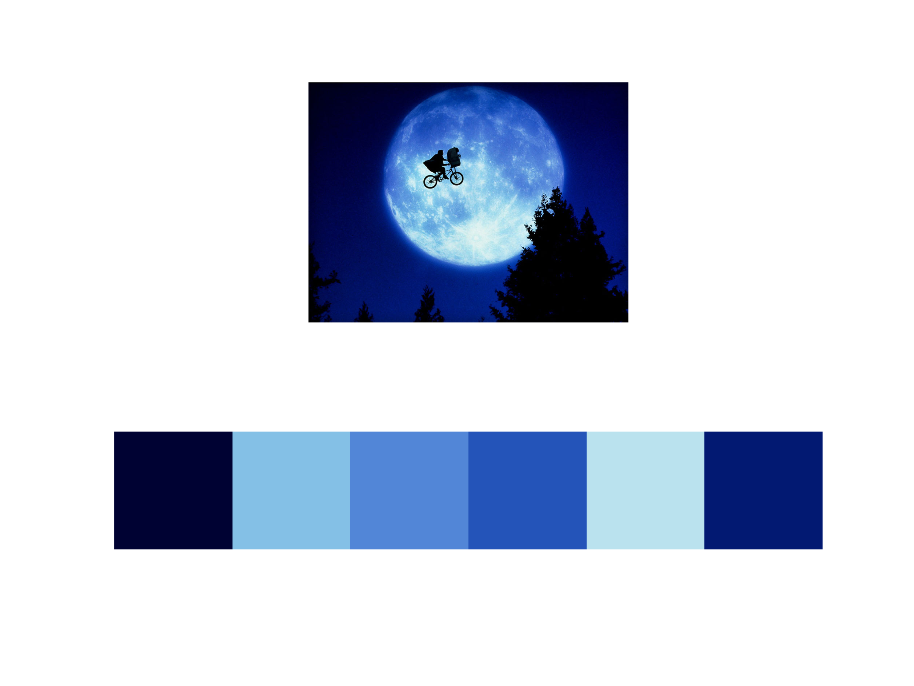
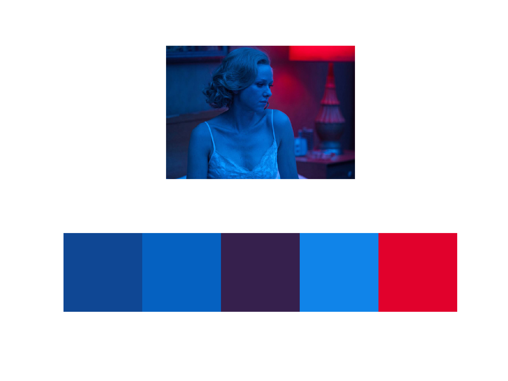

# Palette Extractor

Extracts color palette from an image using KMeans clustering.

## Examples





## Install Dependencies

```bash
pip3 install -r requirements.txt
```

## Running

```bash
python3 src/main.py path-to-image number-of-clusters
```
