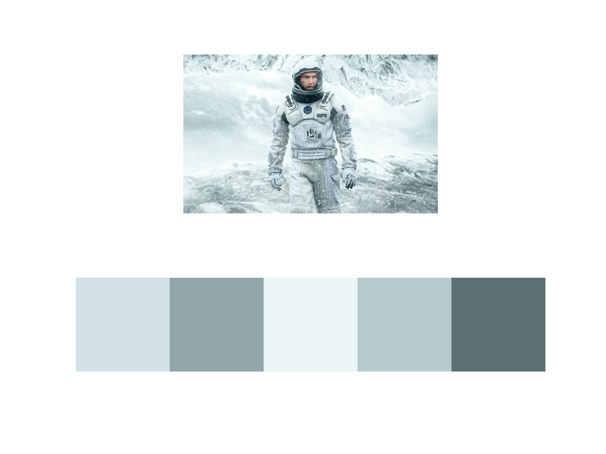

# Palette Extractor

Extracts color palette from an image using KMeans clustering.

## Examples





## Install Dependencies

```bash
pip3 install -r requirements.txt
```

## Running

```bash
python3 src/main.py path-to-image number-of-clusters
```

## How it Works

K-means finds clusters of points that are close together. For example, in the star wars
picture we can see how it found some white, red, brown, and purple clusters below.


